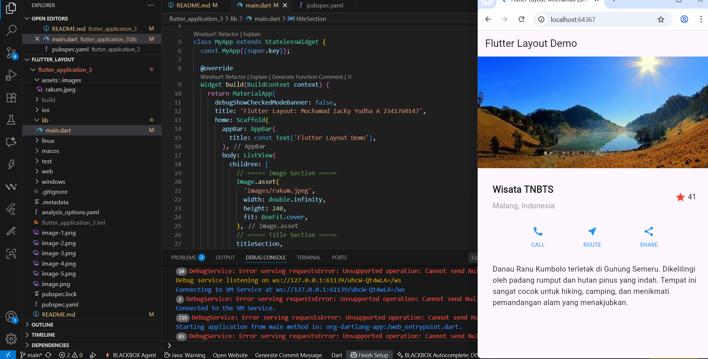
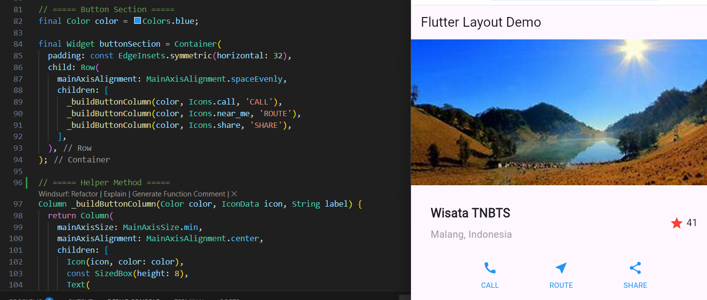
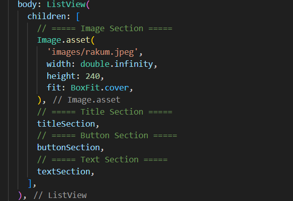
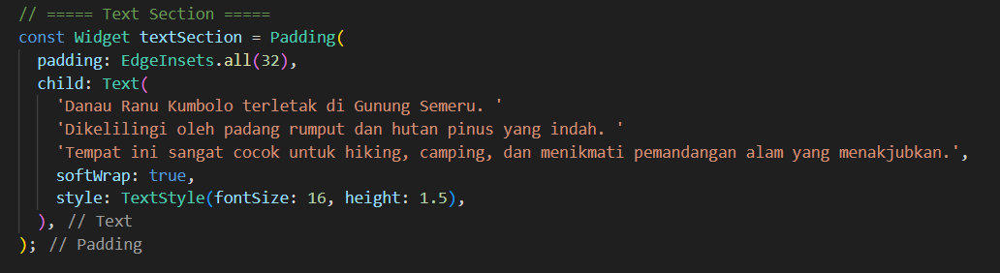
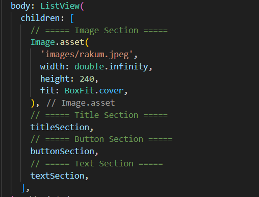
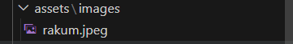
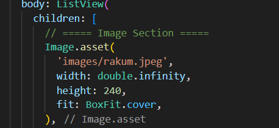
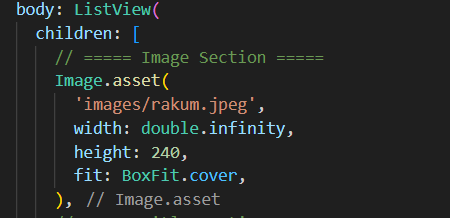

# Praktikum 1 Membangun layout di Flutter
Membuat projek fluter baru 

Buka file main.dart lalu ganti dengan kode berikut, dan isikan nama dan nim

Kemudian menampilkan di aplikasi saya 

Layout utama berupa Column yang berisi beberapa baris. Baris pertama adalah bagian Judul, berupa Row dengan tiga anak: kolom teks (2 baris teks, dibungkus Expanded agar memakan ruang tersisa), ikon bintang, dan angka. Baris kedua adalah bagian Tombol, juga Row dengan tiga anak, masing-masing kolom berisi ikon dan teks. Pendekatan bottom-up dianjurkan: buat dulu widget terkecil dalam variabel atau fungsi untuk meminimalkan kebingungan dari kode layout yang bertumpuk.

Untuk soal 1–3: letakkan Column di dalam Expanded agar menyesuaikan ruang di Row dan atur crossAxisAlignment: CrossAxisAlignment.start supaya kontennya berada di awal, bungkus baris pertama teks dengan Container untuk memberi padding: 8 dan set teks 'Batu, Malang, Indonesia' berwarna abu-abu, lalu di baris judul dua item terakhir berupa ikon bintang berwarna merah dan teks "41" dibungkus Container dengan padding: 32, serta ganti isi body 'Hello World' dengan variabel titleSection.

# Praktikum 2 Implementasi Button Row
Praktikum ini membuat layout Flutter menggunakan ListView yang terdiri dari gambar, judul, tombol, dan teks deskripsi. Judul menampilkan nama tempat, lokasi, ikon bintang, dan rating. Tombol CALL, ROUTE, dan SHARE dibuat menggunakan metode _buildButtonColumn agar ikon di atas teks memiliki tata letak dan warna konsisten. Teks deskripsi diberi padding agar rapi. Metode _buildButtonColumn mempermudah pembuatan tombol tanpa mengulang kode dan menjaga tampilan responsif.

buttonSection adalah baris (Row) yang berisi tiga kolom tombol. Setiap kolom dibangun menggunakan fungsi _buildButtonColumn yang menerima parameter warna, ikon, dan teks. Teks diletakkan di dalam Container dengan margin atas agar terpisah dari ikon. Kolom-kolom ini sejajar dengan MainAxisAlignment.spaceEvenly sehingga jarak antar tombol dan tepi baris merata.

Menambahkan button section ke body

# Praktikum 3 Implementasi Text Section
Membuat widget text section

Menambahkan variabel text section ke body

# Praktikum 4 Implementasi Image Section

Membuat folder assets untuk gambar

Menambahkan asset gambar ke body

Pada langkah terakhir ini, atur semua elemen dalam ListView, bukan Column, karena ListView mendukung scroll yang dinamis saat aplikasi dijalankan pada perangkat yang resolusinya lebih kecil.

