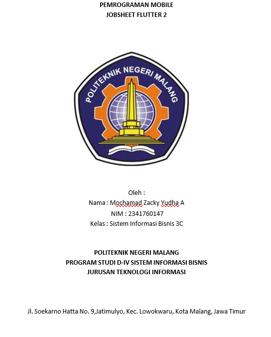
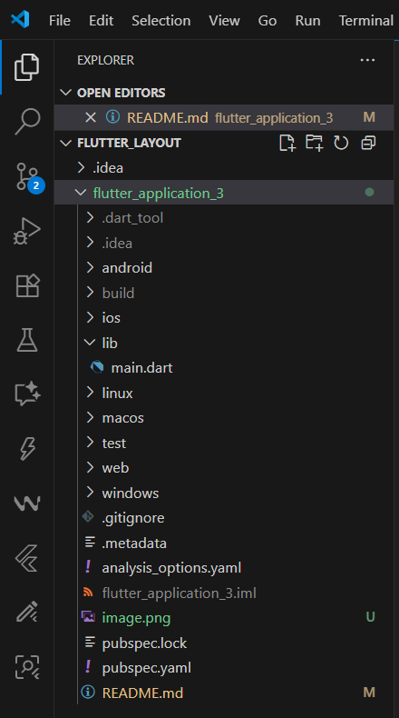
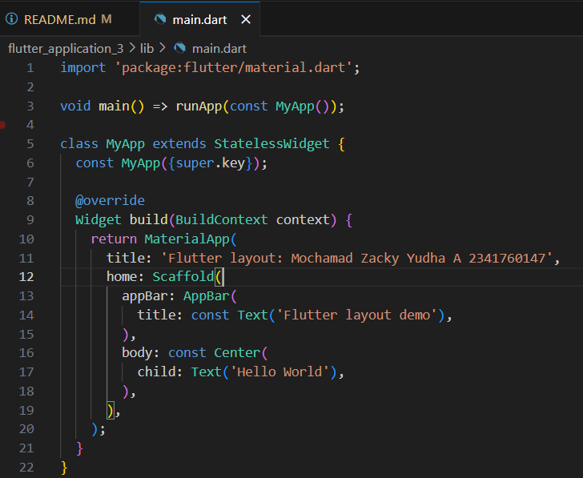
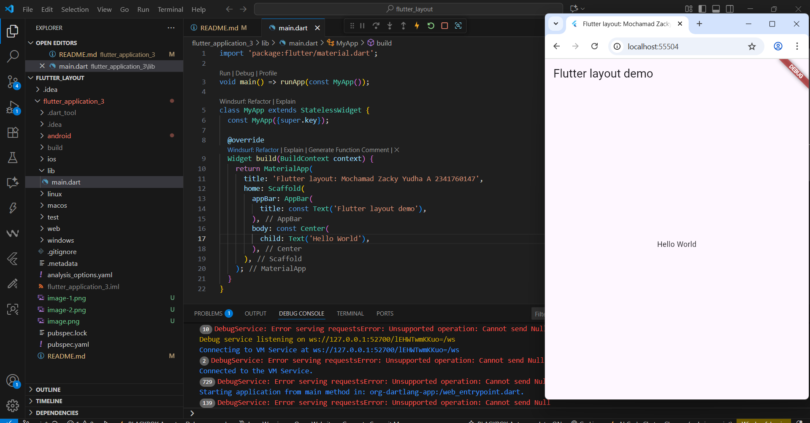
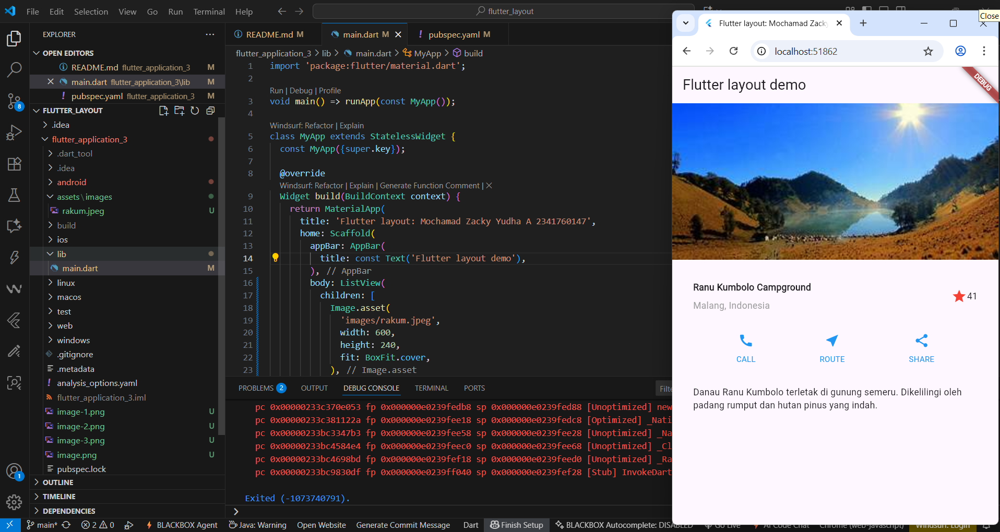
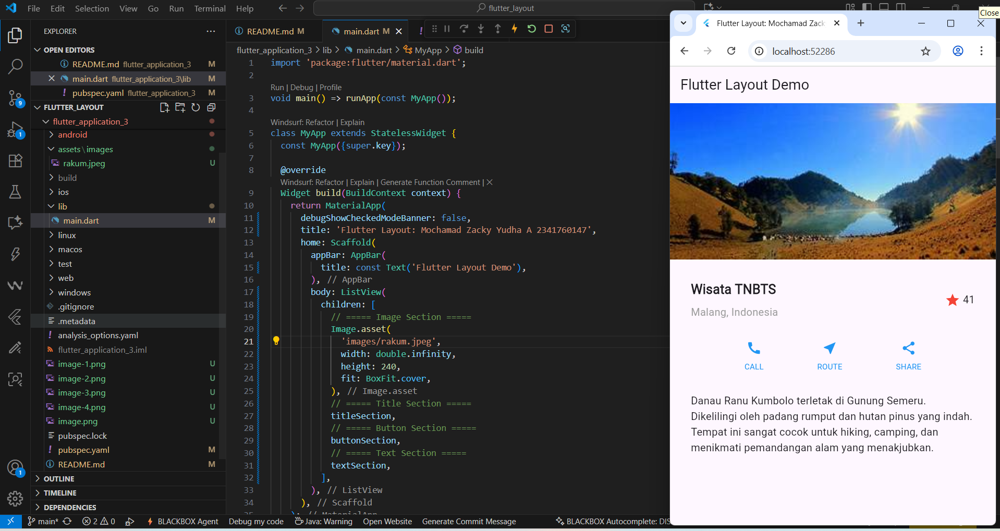

# Praktikum 1 Membangun layout di Flutter
Membuat projek fluter baru 

Buka file main.dart lalu ganti dengan kode berikut, dan isikan nama dan nim

Kemudian menampilkan di aplikasi saya 

Layout utama berupa Column yang berisi beberapa baris. Baris pertama adalah bagian Judul, berupa Row dengan tiga anak: kolom teks (2 baris teks, dibungkus Expanded agar memakan ruang tersisa), ikon bintang, dan angka. Baris kedua adalah bagian Tombol, juga Row dengan tiga anak, masing-masing kolom berisi ikon dan teks. Pendekatan bottom-up dianjurkan: buat dulu widget terkecil dalam variabel atau fungsi untuk meminimalkan kebingungan dari kode layout yang bertumpuk.

Untuk soal 1–3: letakkan Column di dalam Expanded agar menyesuaikan ruang di Row dan atur crossAxisAlignment: CrossAxisAlignment.start supaya kontennya berada di awal, bungkus baris pertama teks dengan Container untuk memberi padding: 8 dan set teks 'Batu, Malang, Indonesia' berwarna abu-abu, lalu di baris judul dua item terakhir berupa ikon bintang berwarna merah dan teks "41" dibungkus Container dengan padding: 32, serta ganti isi body 'Hello World' dengan variabel titleSection.

