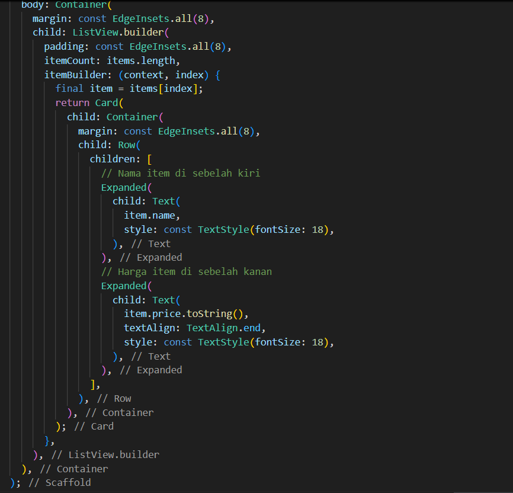
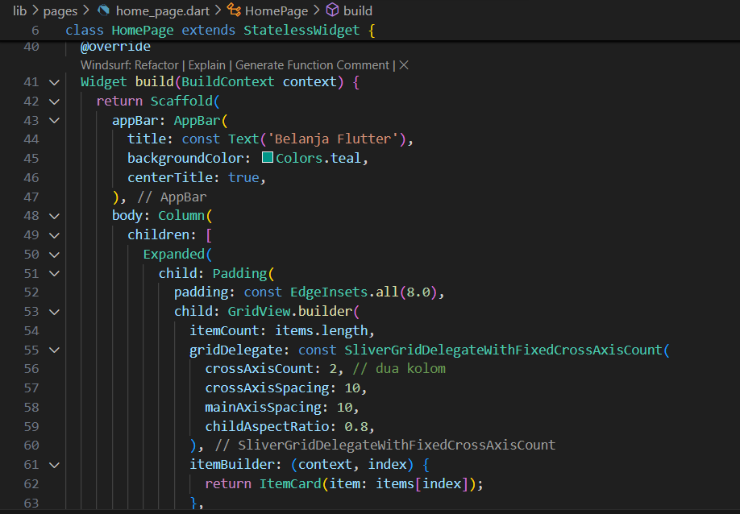

# Praktikum 1 Membangun layout di Flutter
Membuat projek fluter baru 

Buka file main.dart lalu ganti dengan kode berikut, dan isikan nama dan nim

Kemudian menampilkan di aplikasi saya 

Layout utama berupa Column yang berisi beberapa baris. Baris pertama adalah bagian Judul, berupa Row dengan tiga anak: kolom teks (2 baris teks, dibungkus Expanded agar memakan ruang tersisa), ikon bintang, dan angka. Baris kedua adalah bagian Tombol, juga Row dengan tiga anak, masing-masing kolom berisi ikon dan teks. Pendekatan bottom-up dianjurkan: buat dulu widget terkecil dalam variabel atau fungsi untuk meminimalkan kebingungan dari kode layout yang bertumpuk.

Untuk soal 1–3: letakkan Column di dalam Expanded agar menyesuaikan ruang di Row dan atur crossAxisAlignment: CrossAxisAlignment.start supaya kontennya berada di awal, bungkus baris pertama teks dengan Container untuk memberi padding: 8 dan set teks 'Batu, Malang, Indonesia' berwarna abu-abu, lalu di baris judul dua item terakhir berupa ikon bintang berwarna merah dan teks "41" dibungkus Container dengan padding: 32, serta ganti isi body 'Hello World' dengan variabel titleSection.

# Praktikum 2 Implementasi Button Row
Praktikum ini membuat layout Flutter menggunakan ListView yang terdiri dari gambar, judul, tombol, dan teks deskripsi. Judul menampilkan nama tempat, lokasi, ikon bintang, dan rating. Tombol CALL, ROUTE, dan SHARE dibuat menggunakan metode _buildButtonColumn agar ikon di atas teks memiliki tata letak dan warna konsisten. Teks deskripsi diberi padding agar rapi. Metode _buildButtonColumn mempermudah pembuatan tombol tanpa mengulang kode dan menjaga tampilan responsif.

buttonSection adalah baris (Row) yang berisi tiga kolom tombol. Setiap kolom dibangun menggunakan fungsi _buildButtonColumn yang menerima parameter warna, ikon, dan teks. Teks diletakkan di dalam Container dengan margin atas agar terpisah dari ikon. Kolom-kolom ini sejajar dengan MainAxisAlignment.spaceEvenly sehingga jarak antar tombol dan tepi baris merata.

Menambahkan button section ke body

# Praktikum 3 Implementasi Text Section
Membuat widget text section

Menambahkan variabel text section ke body

# Praktikum 4 Implementasi Image Section

Membuat folder assets untuk gambar

Menambahkan asset gambar ke body

Pada langkah terakhir ini, atur semua elemen dalam ListView, bukan Column, karena ListView mendukung scroll yang dinamis saat aplikasi dijalankan pada perangkat yang resolusinya lebih kecil.

# Praktikum 5 Membangun Navigasi di Flutter
Membuat projek baru flutter dengan nama belanja dan menyusun folder seperti berikut

Membuat 2 buah file bernama home_page.dart dan item_page.dart dalam folder pages
Kemudian untuk masing-masing file, deklarasikan class HomePage pada file home_page.dart dan ItemPage pada item_page.dart. Turunkan class dari StatelessWidget. Gambaran potongan kode dapat anda lihat sebagai berikut

Setelah kedua halaman telah dibuat dan didefinisikan, bukalah file main.dart. Pada langkah ini anda akan mendefinisikan Route untuk kedua halaman tersebut. Definisi penamaan route harus bersifat unique. Halaman HomePage didefinisikan sebagai /. Dan halaman ItemPage didefinisikan sebagai /item. Untuk mendefinisikan halaman awal, anda dapat menggunakan named argument initialRoute

Membuat proses pemodelan data dengan membuat file item.dart dan diletakkan pada folder models

Melengkapi kode di class home pages

Untuk menampilkan ListView pada praktikum ini digunakan itemBuilder. Data diambil dari definisi model yang telah dibuat sebelumnya. Untuk menunjukkan batas data satu dan berikutnya digunakan widget Card. Kode yang telah umum pada bagian ini tidak ditampilkan.

Tampilan setelah dijalankan 

Menambahkan aksi pada ListView
Untuk menambahkan sentuhan, letakkan cursor pada widget pembuka Card. Kemudian gunakan shortcut quick fix dari VSCode (Ctrl + . pada Windows atau Cmd + . pada MacOS). Sorot menu wrap with widget... Ubah nilai widget menjadi InkWell serta tambahkan named argument onTap yang berisi fungsi untuk berpindah ke halaman ItemPage. 

Dan seperti berikut hasilnya setelah dijalankan, saat di klik salah satu item di home page akan berpindah ke item page 

# Tugas Praktikum 2
Untuk melakukan pengiriman data ke halaman berikutnya, cukup menambahkan informasi arguments pada penggunaan Navigator

Menambahkan atribut foto produk,stock, dan rating
yang pertama mengubah models item agar mencakup atribut baru 

Kemudian mengedit file pages untuk menambahkan data sesuai atribut baru 

pecah widget menjadi kode yang lebih kecil. Tambahkan Nama dan NIM di footer aplikasi belanja Anda.
Membuat file item_card.dart dan footer.dart pada folder widgets

Dan tampilan akhir seperti berikut 

